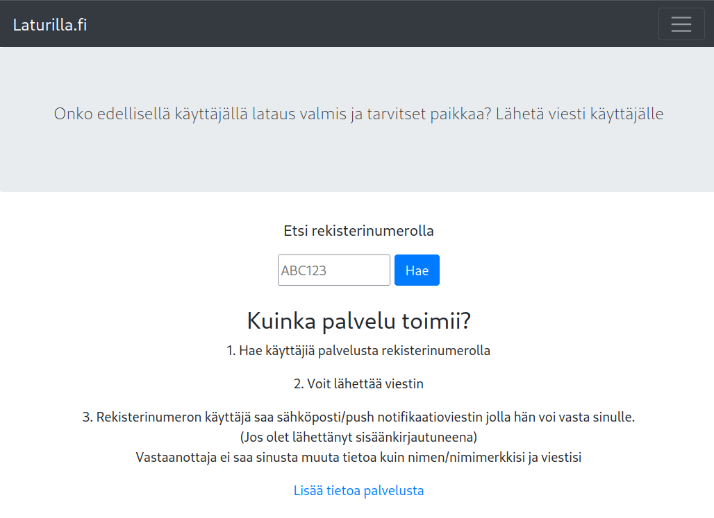
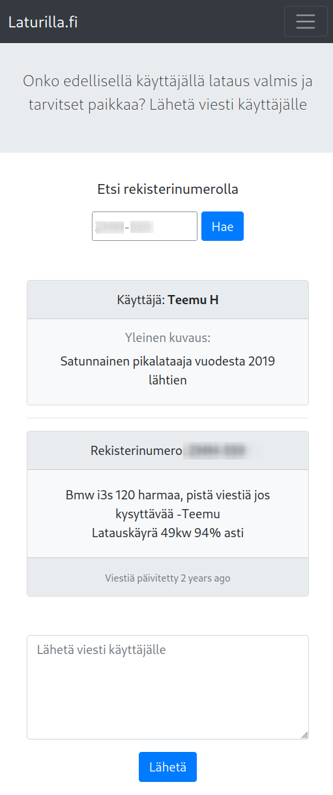
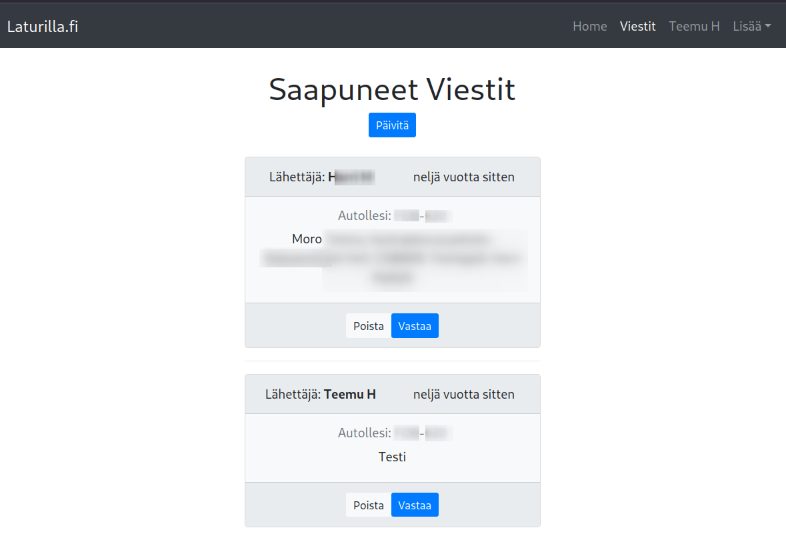
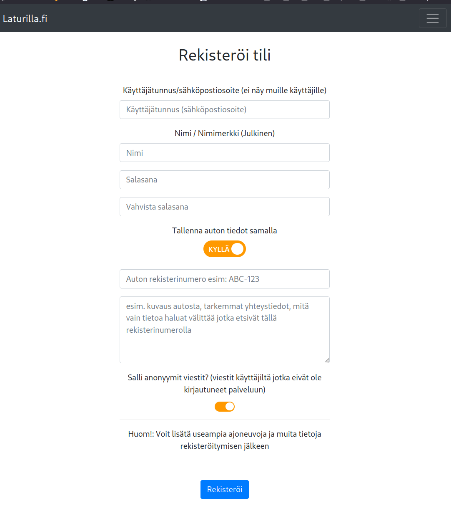
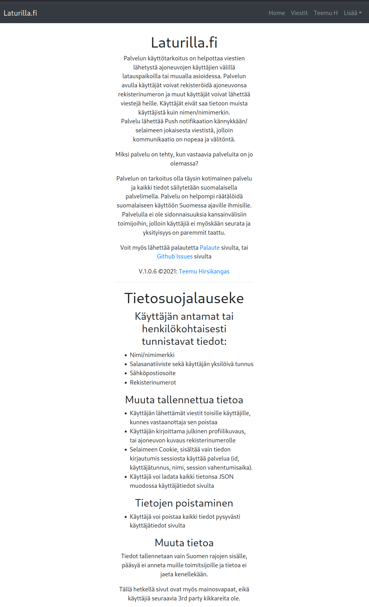
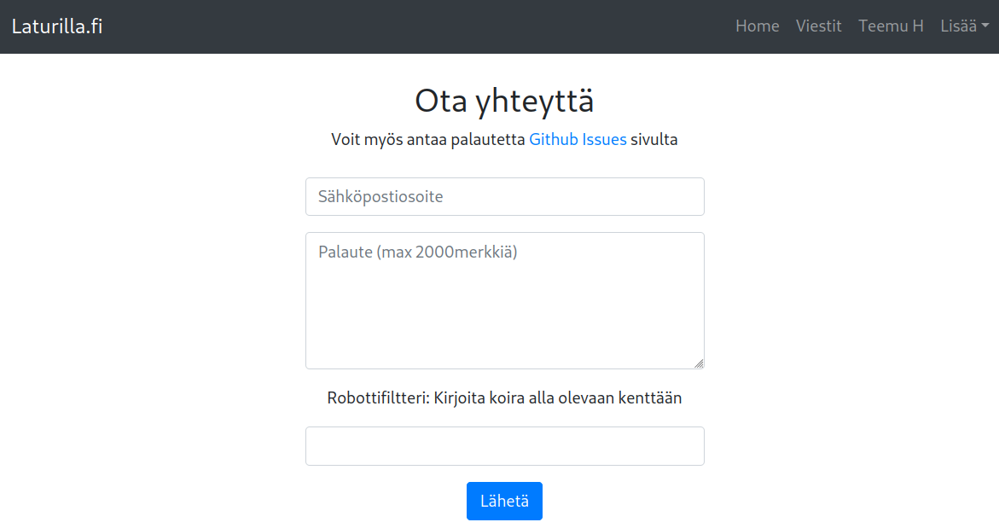
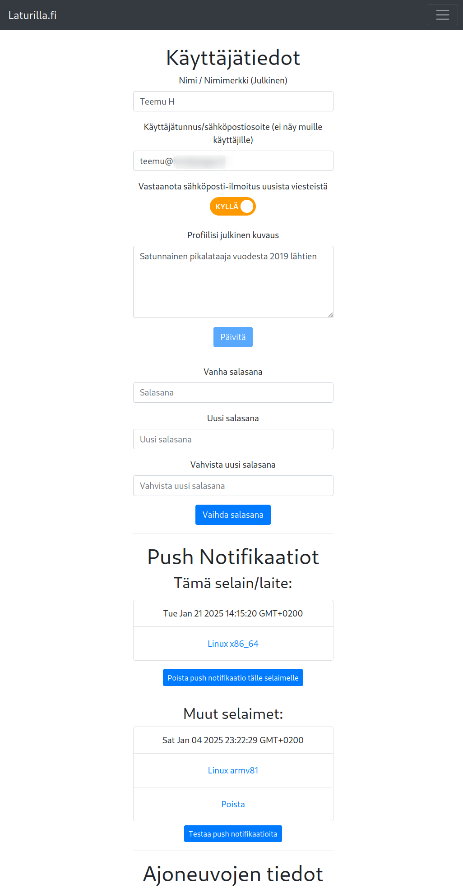
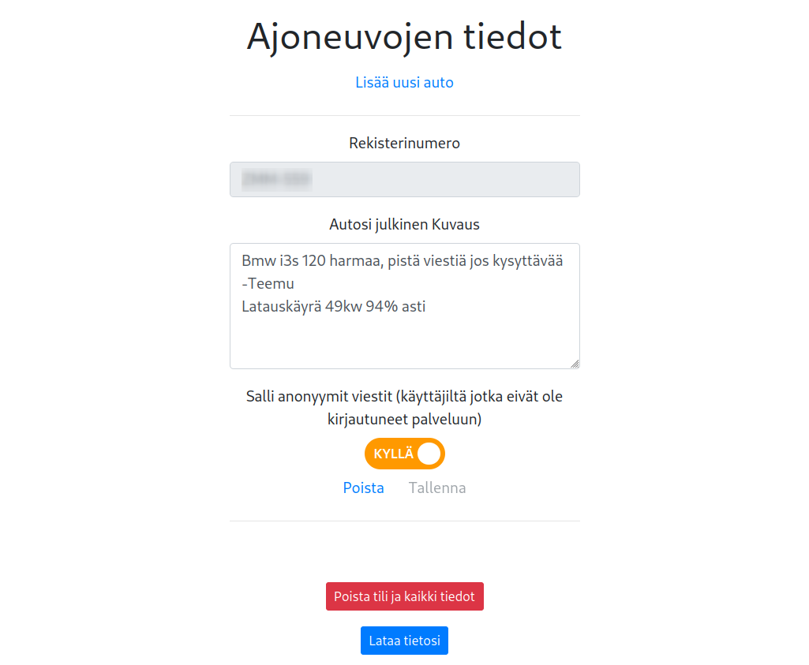

# Laturilla.fi

26.2.2025 laturilla.fi site closed and source code made public in this repository and all records and registrations deleted.

Year 2020 was different times, public charging points where few, and usually only one per site,
now in 2025, charging places are everywhere no need to worry if charging places are

This was mainly hobby project to learn react from scratch, before AI tools, might not contains so elegant solutions

## Screenshots










# ORIGINAL readme.md

https://Laturilla.fi

Public issues:
https://github.com/teemuhirsikangas/laturilla.fi/issues

Copyright by Teemu Hirsikangas 2021
(edit: 2025, please use or share as you like, no copyright anymore)

## How to deploy

```
git clone https://github.com/teemuhirsikangas/laturilla.fi.gi

#to start the nodejs static build
npm run start || test: serve -l 3000 -s build

#start the server api (not needed, unless client is run somewhere else)
npm run server
```
# Dev

## Docker

```
export DOCKER_GATEWAY_HOST=172.17.0.1
docker run --name laturilla --network="host" -p 5000:5000 laturilla
```

### DEV

```
npm run dev
```

### PROD

```
just use the ./start.sh
OR
#docker build -t laturilla .
#docker run --name laturilla --network="host" -d --restart unless-stopped laturilla
```

```
ssh:
ssh connection for mongoose db: ssh -L 9000:localhost:27017 username@laturilla.fi
```
### Push notifications

Provided by google firebase, see .env files to setup keys

### Certificates

- TLS certs provided by: let's encrypt with certbot
- Congratulations! Your certificate and chain have been saved at:
   /etc/letsencrypt/live/laturilla.fi/fullchain.pem
   Your key file has been saved at:
   /etc/letsencrypt/live/laturilla.fi/privkey.pem
   Your cert will expire on 2020-11-18. To obtain a new or tweaked
   version of this certificate in the future, simply run certbot again
   with the "certonly" option. To non-interactively renew *all* of
   your certificates, run "certbot renew"
 - If you like Certbot, please consider supporting our work by:
